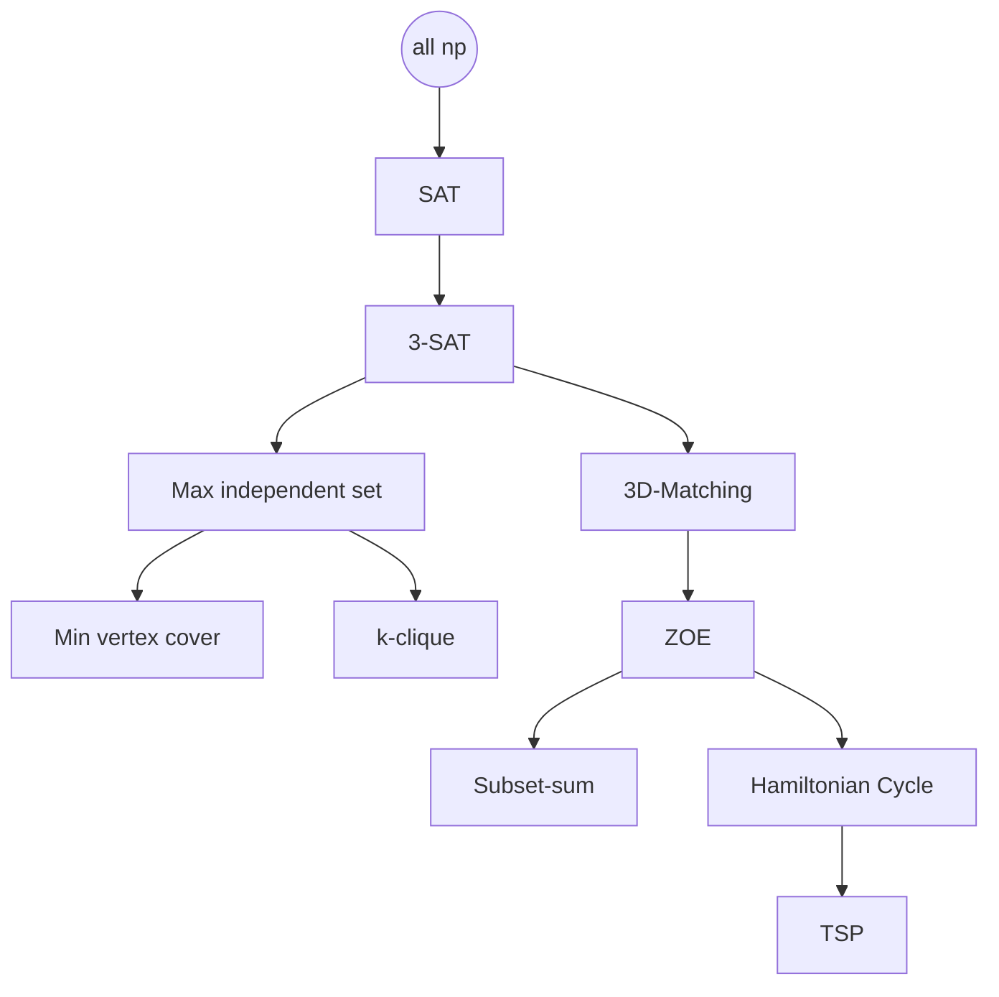

[toc]
# Basic Complexity Theory
## Introduction
### SAT 可满足性问题
$$\phi=(x\vee y\vee z)\wedge (x\vee \bar{y})\wedge(y\vee \bar{z})\wedge(z\vee \bar{x})$$问对于输入$\phi$是否存在$x,y,z$的取值使得$\phi$满足
### 2-SAT
$$\begin{aligned}
    \phi=\bigwedge_{i}c_i
\end{aligned}$$其中$|c_i|=2$
有多项式时间算法：
假设$c_i=(x\vee y)$，等价于$(\bar{x}\to y)$，可以通过建立 $x_i$ 和 $\bar{x}_i$ 的有向图，连边为$(\bar{x}\to y)$，看有没有 $x_i$ 和 $\bar{x}_i$ 在一个强连通分量里，没有就可满足。
### TSP
一个完全图，一个最小的环经过所有的点。
动态规划可以在$O(n \cdot2^n)$解

### MST
一个完全图，一个最小的树包括所有的点。
多项式时间 Kruskal，Prim
### Hamiltonian Circuit
是否存在回路访问每个点一次
动态规划指数级
### Euler Circuit
是否存在回路访问每个边一次
有多项式时间算法
### Balenced min-cut
要求分为的两部分不太小。
如$(|c_1|>\frac{n}{3})\vee (|c_2|>\frac{n}{3})$
### min-cut
固定一个点作为$s$，遍历其他的点设为$t$，算$s\to t$的最大流。取最小的最大流。
### LP
内点法，椭球法
### 整数规划
例如 ZOE：
$$A x=1\\
x_i\in\{0, 1\}$$
### max indenpendent set
**indenpendent set**：在图上找一些点使得这些点互相不为邻居
**max indenpendent set**：indenpendent set 最多能包含多少个点
无多项式时间算法
### min vertex cover
是 max indenpendent set 的补集
**vertex cover**：找一个点集使得任意边存在一个点在点集里
无多项式时间算法
### max clique
找一个最大的点集使得点集内的任意两点之间都有边
无多项式时间算法
### shortest path
多项式
### longest simple path
$s\to t$最长的路（不能重复访问顶点）
无多项式时间算法
### Knapsack
背包问题，$W$为背包容量
$$O(W\cdot\text{poly}(n))$$
无多项式时间算法
### Subset sum
从集合中找一个子集使得其和正好为$W$
无多项式时间算法

### Matching
二分图匹配，网络流求解
### 3D-Maching
(boys,girls,pets)
NP-complete
## Theory of Computational Complexity
### Decision Problem
判定性问题
### P
$$P\equiv \text{collection of decision problem computable by a poly-time algorithm}$$
多项式时间内可计算的问题
### NP
Non-deterministc Polynoimial-time
多项式时间内可验证的问题
$$\text{P}\subseteq\text{NP}$$
### (Karp) Reduction
$$f\le_k g\\
\forall x,f(x)=1\iff g(R(x))=1$$
### NP-Complete
NP中最难的问题
- $f \in \text{NP}$
- $\forall g\in \text{NP}, g\le_k f$

**Cook-Lovin Therom:** SAT is NP-Complete

### (Cook/Turing) Reduction
不要求是decision problem
$$f\le_\text{T} g$$
如果可以多项式时间解$g$，则可以多项式时间解$f$
$(f\le_\text{k} g)\Rightarrow(f\le_\text{T} g)$
### NP-hard
- $\exist f\in \text{NP-conplete}$
- $f\le_\text{T}g$

NP-hard 不一定属于NP，因为可能不是判定性问题
## Web of Reduction

证明NP-complete，先证明是NP的

### SAT $\le_\text{k}$ 3-SAT
对SAT中的 $c_i=(a_1\vee...\vee a_k)$
引入$y_1,...,y_{k-3}$
$c_i\to (a_1\vee a_2\vee y_1)\wedge(\bar{y}_1\vee a_3\vee y_2)\wedge...\wedge(\bar{y}_{k-3}\vee a_{k-1}\vee a_{k})$
证明：
$\rightarrow$:至少有一个$a_i$为true，让它前面的$y_j$都为true，后面的都为false
$\leftarrow$:反证法，假设没有一个$a_i$为true，则3-SAT的式子不能满足。

### 3-SAT $\le_\text{k}$ Max independent set

### max independent set $\le_\text{k}$ k-clique
对于k-独立集问题$(G,k)$
对$G$取补集$\bar{G}$，$\bar{G}$中的边为${G}$中没有的边
则$(\bar{G},k)$满足k-clique等价于$(G,k)$满足k-independent set
### max independent set $\le_\text{k}$ k-vertex cover

### 3-SAT*
$$\phi\in\text{3-SAT*}\\
\text{Count}(x)+\text{Count}(\bar{x})\le 3\\
\text{Count}(x)\le2\\
\text{Count}(\bar{x})\le 2$$
将出现的 $k$ 次 $x$ 设为 $x_i$，再加上限制条件$(x_1\to x_2)\wedge(x_2\to x_3)\wedge...\wedge(x_k\to x_1)$
即$(\bar{x}_1\vee x_2)\wedge(\bar{x}_2\vee x_3)\wedge...\wedge(\bar{x}_k\vee x_1)$
### 3-SAT* $\le_\text{k}$ 3D-Matching

### 3D-Matching $\le_\text{k}$ ZOE

### ZOE $\le_\text{k}$ Subset sum

### ZOE $\le_\text{k}$ Hamiltonian Cycle

### Hamiltonian Cycle $\le_\text{k}$ TSP

### 3-SAT $\le_\text{k}$ 3-Coloring
